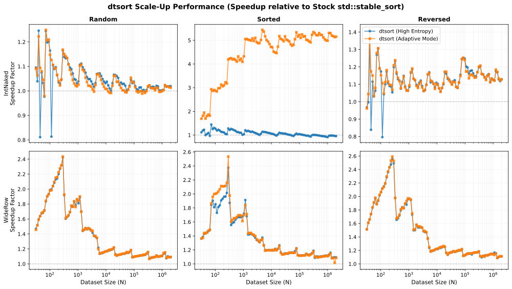

# dtsort

**A decision-tree based stable sort that beats `std::stable_sort`. Header-only. Drop-in.**

[](LICENSE)
[](https://isocpp.org/std/the-standard)
[](#quick-start)
[](#)
[](https://www.python.org)

---

`dt_stable_sort` is a drop-in replacement for `std::stable_sort` that delivers **up to 2.4× faster throughput** on heavy records and sustained **10–12% gains at million-element scale**.

It works by replacing the insertion-sort leaf cases in hybrid sorting algorithms with decision-tree kernels that achieve [at or within one comparison](https://oeis.org/A036604) of the information-theoretic minimum for small arrays (N ≤ 10), and apply results via move-optimal cycle decomposition. Adaptive mode (enabled by default) adds near-zero-cost run detection, making it even faster for sorted and partially-sorted inputs.

---

## Performance at a Glance

| Workload                          | Peak Speedup                 | Sustained (N ≥ 100K) |                                                                                                                                                                            |
| --------------------------------- | ---------------------------- | -------------------- | -------------------------------------------------------------------------------------------------------------------------------------------------------------------------- |
| **Heavy 4 KB records** (random)   | **up to 2.4×** faster        | +10–12%              | [→ Explore](https://michals.github.io/dtsort/interactive_report.html#tab=curves&type=WideRow&pattern=random&metric=speedup&minN=25&maxN=2000000&tpType=IntNaked&chart=dt)  |
| **Heavy 4 KB records** (reversed) | **up to 2.6×** faster        | +10–12%              | [→ Explore](https://michals.github.io/dtsort/interactive_report.html#tab=curves&type=WideRow&pattern=reverse&metric=speedup&minN=25&maxN=2000000&tpType=IntNaked&chart=dt) |
| **Integers** (random)             | **up to 2.6×** faster (N=10) | +1–3%                | [→ Explore](https://michals.github.io/dtsort/interactive_report.html#tab=curves&type=IntNaked&pattern=random&metric=speedup&minN=25&maxN=2000000&tpType=IntNaked&chart=dt) |
| **Pre-sorted** (adaptive mode)    | **up to 4.4×** faster        | Competitive          | [→ Explore](https://michals.github.io/dtsort/interactive_report.html#tab=curves&type=IntNaked&pattern=sorted&metric=speedup&minN=25&maxN=2000000&tpType=IntNaked&chart=dt) |

> _Measured on Apple M4 vs stock `std::stable_sort`. All gains are relative speedups._
> _[Full results & methodology →](RESULTS.md) · [Interactive benchmark explorer →](https://michals.github.io/dtsort/interactive_report.html)_



---

## Quick Start

Since dtsort is a header-only library in `cpp/include/`, just add it to your include path:

```cpp
#include "dt_stable_sort.hh"

std::vector<int> v = {5, 3, 8, 1, 9, 2, 7, 4, 6, 10};
dt_stable_sort(v.begin(), v.end());  // Sorted!
```

It works with custom comparators and complex types too — the sort is **stable**, preserving the relative order of equal elements:

```cpp
struct Student {
    std::string name;
    int grade;
};

std::vector<Student> students = {{"Alice", 90}, {"Bob", 85}, {"Charlie", 90}, {"Dave", 70}};

// Sort by grade descending — students with the same grade keep their original order
dt_stable_sort(students.begin(), students.end(),
    [](const Student& a, const Student& b) { return a.grade > b.grade; });
```

Build and run the included examples:

```bash
make examples
```

For complete demos, see [`cpp/examples/simple_sort.cc`](cpp/examples/simple_sort.cc) and [`cpp/examples/simple_benchmark.cc`](cpp/examples/simple_benchmark.cc).

---

## How It Works

The core insight: **sorting N elements is equivalent to identifying which of the N! possible permutations the input represents.** This is a classification problem — and decision trees are the optimal tool for binary classification.

1. **Sorting as classification** — A binary decision tree of pairwise comparisons identifies the exact input permutation. The minimum possible tree depth is ⌈log₂(N!)⌉ comparisons ([OEIS A036604](https://oeis.org/A036604)).

2. **Greedy tree construction** — The code generator builds the tree using a greedy entropy-minimizing split heuristic (equivalent to the ID3 algorithm from machine learning). For N=2..5, this achieves the information-theoretic minimum. For N=6..10, it gets within one comparison of the minimum.

3. **Cycle decomposition** — Once the permutation is identified, the inverse is applied via disjoint cycles. A cycle of length k requires exactly k+1 moves — the theoretical minimum for in-place permutation.


_The complete N=3 decision tree: 3 comparisons in the worst case identify any of the 6 possible permutations, then cycle decomposition sorts in-place with minimal moves._

> 📖 This project began 20 years ago as a student's quest for the mathematically "perfect sort." [Read the full story →](codegen/docs/history.md)

---

## Key Innovations

### Group-Sorted Decision Trees (gsDT)

A raw decision tree for N=10 would have 10! = 3,628,800 leaves — gigabytes of generated code. The **gsDT architecture** solves this by pre-sorting elements into independent groups (e.g., two groups of 5 for N=10), then using a decision tree to optimally merge the pre-sorted sequences. This compresses 3.6 million leaves down to just 252 — with the remarkably favorable tradeoff of only **+1 worst-case comparison** relative to the absolute mathematical minimum.

The entire N=2..10 kernel suite totals ~56 KB of generated C++ headers, fitting easily in the L1 instruction cache.

### Block-Scoped Index Sorting

For heavy objects (where `sizeof(T) > 32` bytes), moving or swapping elements is the dominant cost. Block-scoped index sorting decouples comparisons from data movement:

1. Sort lightweight integer indices within cache-resident blocks
2. Scatter payloads in a single pass — **exactly 1.0× N payload moves**

The default block size is `MAX_N × 16 = 160` elements, tuned for Apple M-series L2 cache. This is configurable via the `DT_BLOCK_SIZE` compile-time macro for different hardware.

---

## The `dt_stable_sort` Engine

`dt_stable_sort` is not just a small-array trick — it's a complete hybrid stable sorting engine:

- **DFS ping-pong merging** — Top-down recursion with alternating primary/auxiliary buffers eliminates the "parity penalty" copy pass present in bottom-up designs.
- **Adaptive merge-skipping** (enabled by default) — Near-zero-cost sorted-run detection at every merge level, achieved without a separate pre-scan pass. Can be disabled via `#define DT_ADAPTIVE 0` for maximum throughput on known high-entropy data.
- **Cache-boundary-aware block sizing** — Leaf blocks sized to fit L2 cache, preventing performance cliffs at block boundaries.

For detailed performance analysis across workloads, see [**RESULTS.md**](RESULTS.md).

---

## Benchmarks

### Pre-Packaged Results

The latest verified benchmark results are in [`cpp/benchmark/results/`](cpp/benchmark/results/). Open [`interactive_report.html`](cpp/benchmark/results/reports/interactive_report.html) in any browser, or explore the published version:

🔗 **[Interactive Benchmark Explorer →](https://michals.github.io/dtsort/interactive_report.html)**

### Reproducing on Your Hardware

**Prerequisites**: CMake 3.16+, C++20 compiler (GCC 10+ or Clang 12+), Python 3.11+ with [`uv`](https://github.com/astral-sh/uv), internet (first build fetches [Google Benchmark](https://github.com/google/benchmark)).

```bash
# Quick operation-count sweep — minutes
make bench-fast

# Full benchmark — several hours on Apple M4
make bench
```

The orchestrator generates an interactive HTML report in `cpp/benchmark/logs/<timestamp>/`.

<details>
<summary>Advanced benchmark options</summary>

```bash
cd cpp/benchmark

# Preview estimated runtime before committing
uv run main.py --impls DT --dry-run

# Custom scope (50 log-spaced sizes, specific inputs)
uv run main.py --impls DT --sizes 50:20:100000 --inputs random,reversed,sorted

# Full help
uv run main.py --help
```

</details>

---

## Building the Code Generator

The generator under `codegen/` builds the decision trees and emits the C++ sorting kernels. Use this if you want to modify heuristics, explore different group-sort configurations, or regenerate the `.hh` headers from scratch.

```bash
cd codegen
cmake -B build && cmake --build build

# Generate all sorter headers
./build/dtsort-codegen

# Run correctness verification (all N! permutations)
./build/dtsort-verify-em --check-all    # High Entropy Mode
./build/dtsort-verify-am --check-all    # Adaptive Mode
```

---

## Repository Layout

dtsort is a header-only library in [`cpp/include/`](cpp/include/). The code generator lives in [`codegen/`](codegen/). See [**docs/project-map.md**](docs/project-map.md) for the full repository layout and key file descriptions.

---

## License

All core code and generated artifacts developed for this project are released under the [MIT License](LICENSE).

### Third-Party Code

The benchmarking suite includes snapshots of third-party C++ standard library implementations (under [`cpp/benchmark/cpp/stdlib_impls/`](cpp/benchmark/cpp/stdlib_impls/)) for isolated, reproducible patching and comparison:

- **GCC libstdc++** snapshots: [GPL v3 with Runtime Exception](https://gcc.gnu.org/onlinedocs/libstdc++/manual/license.html)
- **LLVM libc++** snapshots: [Apache License v2.0 with LLVM Exceptions](https://llvm.org/LICENSE.txt)

These files retain their original copyright and license terms. See [`cpp/benchmark/cpp/stdlib_impls/LICENSE`](cpp/benchmark/cpp/stdlib_impls/LICENSE) for details.
